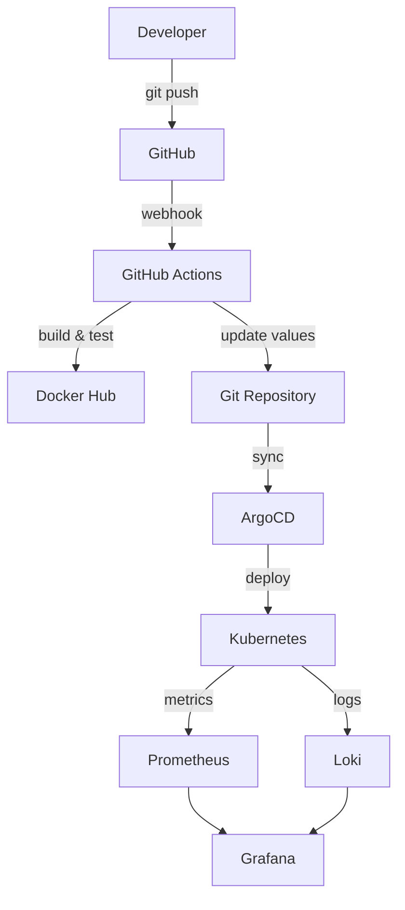

# 🌾 Food API - Agriculture Management System

[](https://github.com/Shohjahon59/DevOps_Shox/actions/workflows/ci-cd.yaml)
[](https://argo-cd.readthedocs.io/)
[](https://prometheus.io/)

Complete DevOps pipeline for Agriculture Management System with monitoring, logging, and automated deployment.

## 🚀 Quick Start

### Prerequisites
- Kubernetes cluster (minikube/kind/cloud)
- Docker
- Helm 3.x
- kubectl

### Deploy
```bash
# Clone repository
git clone https://github.com/Shohjahon59/DevOps_Shox.git
cd DevOps_Shox

# Deploy monitoring stack
helm install kube-prometheus-stack prometheus-community/kube-prometheus-stack -n monitoring -f kube-prom-values.yaml
helm install loki grafana/loki -n monitoring -f loki-values.yaml

# Deploy Food API
helm install foodapi ./foodapi-chart -n default

# Setup ArgoCD
./setup-argocd.sh
```

## 📊 Architecture



## 🛠 Technology Stack

### Application
- **.NET 8.0** - Web API framework
- **Prometheus.NET** - Custom metrics
- **Swagger** - API documentation
- **Docker** - Containerization

### Infrastructure
- **Kubernetes** - Container orchestration
- **Helm** - Package management
- **ArgoCD** - GitOps deployment
- **GitHub Actions** - CI/CD pipeline

### Monitoring
- **Prometheus** - Metrics collection
- **Grafana** - Visualization
- **Loki** - Log aggregation
- **Alertmanager** - Alert management

## 📈 Features

### Food API Endpoints
```
GET  /health          - Health check
GET  /metrics         - Prometheus metrics
POST /orders          - Create order
GET  /swagger         - API documentation
```

### Custom Metrics
```promql
foodapi_orders_created_total       # Total orders created
foodapi_order_duration_seconds     # Order processing time
foodapi_active_users               # Current active users
foodapi_crops_monitored            # Total crops monitored
```

### Monitoring Dashboards
- **System Metrics** - CPU, Memory, Disk, Network
- **Application Metrics** - Request rate, latency, errors
- **Business Metrics** - Orders, users, crops
- **Log Analysis** - Error tracking, performance insights

## 🔄 CI/CD Pipeline

### Automatic Workflow
1. **Code Push** → GitHub repository
2. **GitHub Actions** → Build, test, containerize
3. **Docker Hub** → Store container images
4. **ArgoCD** → GitOps deployment
5. **Kubernetes** → Application running

### Manual Deployment
```bash
# Build and deploy locally
docker build -t rashidov2005/foodapi:latest -f foodapi/Dockerfile foodapi/
helm upgrade --install foodapi ./foodapi-chart --set image.tag=latest
```

## 📊 Access Information

### Grafana Dashboard
```bash
kubectl port-forward -n monitoring svc/kube-prometheus-stack-grafana 3000:80
# URL: http://localhost:3000
# Username: admin
# Password: (see GITHUB-SETUP-GUIDE.md)
```

### ArgoCD UI
```bash
kubectl port-forward svc/argocd-server -n argocd 8080:443
# URL: https://localhost:8080
# Username: admin
# Password: (see setup guide)
```

### Prometheus
```bash
kubectl port-forward -n monitoring svc/kube-prometheus-stack-prometheus 9090:9090
# URL: http://localhost:9090
```

## 📚 Documentation

| Document | Description |
|----------|-------------|
| [GITHUB-SETUP-GUIDE.md](GITHUB-SETUP-GUIDE.md) | GitHub secrets and CI/CD activation |
| [CI-CD-GUIDE.md](CI-CD-GUIDE.md) | Complete CI/CD pipeline documentation |
| [SETUP_INSTRUCTIONS.md](SETUP_INSTRUCTIONS.md) | Step-by-step setup guide |
| [SCREENSHOT_TESTING_GUIDE.md](SCREENSHOT_TESTING_GUIDE.md) | Testing and screenshot guide |
| [monitoring-queries.md](monitoring-queries.md) | PromQL and LogQL examples |

## 🧪 Testing

### Run All Tests
```bash
./test-cicd.sh
```

### Individual Tests
```bash
# .NET build test
dotnet build foodapi/FoodApi/FoodApi.csproj

# Docker build test
docker build -t test -f foodapi/Dockerfile foodapi/

# Helm chart validation
helm lint foodapi-chart/

# Kubernetes deployment test
kubectl apply --dry-run=client -f foodapi-chart/templates/
```

## 🔧 Configuration

### Environment Variables
```yaml
# foodapi-chart/values.yaml
image:
  repository: rashidov2005/foodapi
  tag: "latest"
  pullPolicy: IfNotPresent

resources:
  limits:
    cpu: 500m
    memory: 512Mi
  requests:
    cpu: 100m
    memory: 128Mi
```

### Monitoring Configuration
```yaml
# Prometheus scraping
prometheus.io/scrape: "true"
prometheus.io/port: "8080"
prometheus.io/path: "/metrics"
```

## 🛡 Security

### Best Practices
- ✅ Non-root container user
- ✅ Read-only root filesystem
- ✅ Resource limits
- ✅ Health checks
- ✅ Security contexts
- ✅ Network policies ready

### Secrets Management
```bash
# GitHub Secrets (required)
DOCKERHUB_TOKEN=your_docker_hub_token

# Kubernetes Secrets
kubectl create secret docker-registry regcred \
  --docker-server=docker.io \
  --docker-username=rashidov2005 \
  --docker-password=your_password
```

## 📈 Scaling

### Horizontal Pod Autoscaler
```yaml
# Enable HPA
autoscaling:
  enabled: true
  minReplicas: 2
  maxReplicas: 10
  targetCPUUtilizationPercentage: 80
```

### Vertical Pod Autoscaler
```bash
# Install VPA
kubectl apply -f https://github.com/kubernetes/autoscaler/releases/latest/download/vpa-release.yaml
```

## 🚨 Monitoring & Alerting

### Key Metrics to Monitor
- **Request Rate**: `rate(http_requests_total[5m])`
- **Error Rate**: `rate(http_requests_total{status=~"5.."}[5m])`
- **Response Time**: `histogram_quantile(0.95, rate(http_request_duration_seconds_bucket[5m]))`
- **Resource Usage**: CPU, Memory, Disk

### Alert Rules
```yaml
# High error rate
- alert: HighErrorRate
  expr: rate(http_requests_total{status=~"5.."}[5m]) > 0.1
  for: 5m
  
# High response time
- alert: HighLatency
  expr: histogram_quantile(0.95, rate(http_request_duration_seconds_bucket[5m])) > 1
  for: 5m
```

## 🤝 Contributing

1. Fork the repository
2. Create feature branch (`git checkout -b feature/amazing-feature`)
3. Commit changes (`git commit -m 'Add amazing feature'`)
4. Push to branch (`git push origin feature/amazing-feature`)
5. Open Pull Request

## 📄 License

This project is licensed under the MIT License - see the [LICENSE](LICENSE) file for details.

## 👥 Authors

- **Shohjahon** - [@Shohjahon59](https://github.com/Shohjahon59)

## 🙏 Acknowledgments

- Prometheus Community for monitoring tools
- ArgoCD team for GitOps platform
- Kubernetes community for orchestration
- .NET team for the framework

## 📞 Support

- 📧 Email: shohjahon@example.com
- 💬 Issues: [GitHub Issues](https://github.com/Shohjahon59/DevOps_Shox/issues)
- 📖 Wiki: [Project Wiki](https://github.com/Shohjahon59/DevOps_Shox/wiki)

---

⭐ **Star this repository if it helped you!** ⭐